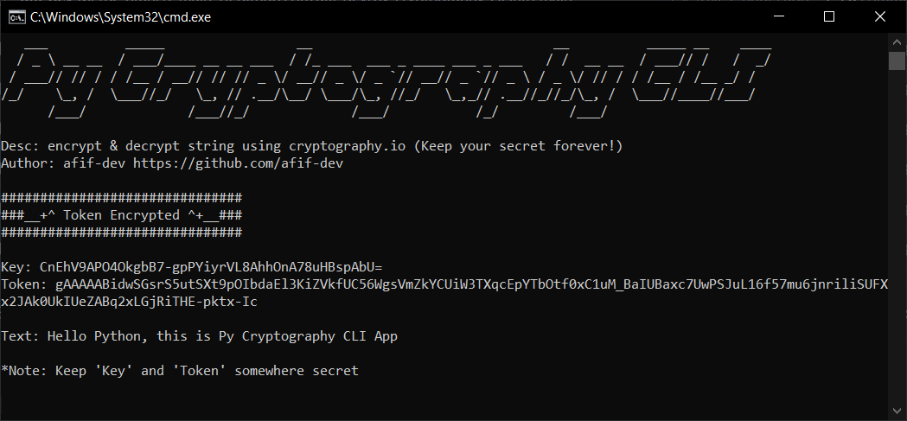

# Py Cryptography CLI App

Encrypt & decrypt string using cryptography.io

CLI app included in distribution folder (dist/py-cryptography-cli.exe)




## Basic Usage
1. Help
```
py py-cryptography-cli -h
```
2. Encrypt text/string
```
py py-cryptography-cli "Hello Python, this is Py Cryptography CLI App"
```
3. Decrypt token
```
py py-cryptography-cli "<TOKEN>" -k "<KEY>"
```

## Setup for Local Development

1. Creating a virtual environment
```
py -m venv venv
```
2. Activate the environment
```
.\venv\Scripts\activate
```
3. Install all of the packages using requirements.txt
```
pip install -r requirements.txt
```
4. Run cli application 
```
py py-cryptography-cli.py -h
```
5. Build cli output (more refer to : https://pyinstaller.org/en/stable/usage.html)
```
pyinstaller py-cryptography-cli.spec
```
6. Export a list of all installed packages (Optional)
```
pip freeze > requirements.txt
```
7. Leaving the environment
```
deactivate
```

## Reference Links
- https://packaging.python.org/en/latest/guides/installing-using-pip-and-virtual-environments/
- https://docs.python.org/3/library/index.html
- https://docs.python.org/3/library/argparse.html
- https://pyinstaller.org/en/stable/usage.html

